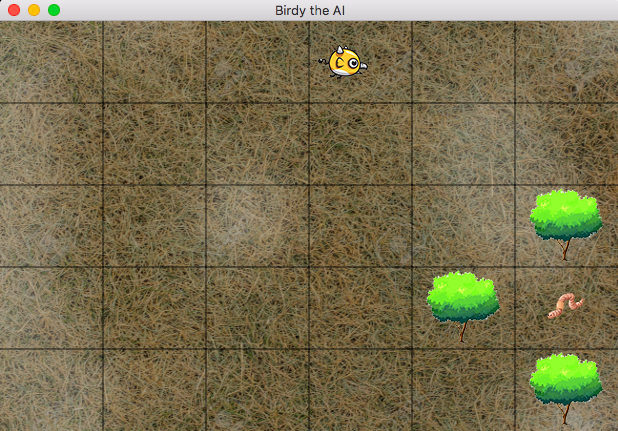

# Birdy the AI

A program that microsimulates a bird's life finding and eating worms. The bird initially has no idea how to track and eat a worm, once he's eaten one it begins to learn where they like to form a habitat and becomes proficient at hunting worms.

