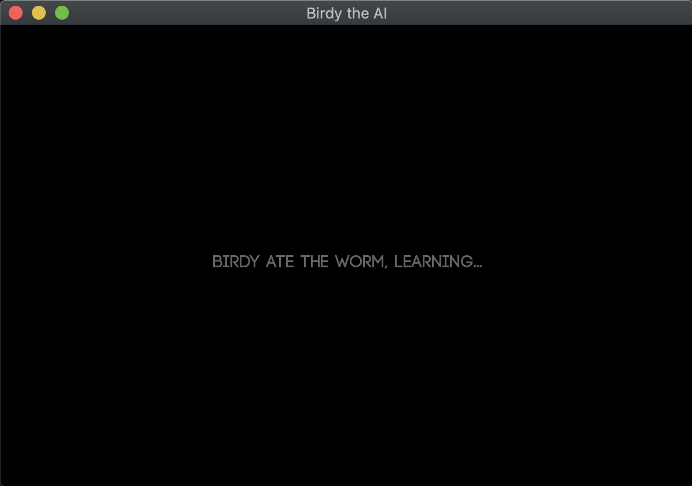

# Birdy the AI

A program that microsimulates a bird's life finding and eating worms. The bird initially has no idea how to track and eat a worm, once he's eaten one it begins to learn where they like to form a habitat and becomes proficient at hunting worms.




## Brief

Essentially a neural network at its most simplest forms, the code could do with an architectural overhaul but it works for now apart from a few bugs. Contributions to improve any aspect of the software are very welcome. I would post issues but I am not actively maintaining this project as I have a lot of other projects on my hands.

## Build

1. Make sure you have SFML installed on your system. In my case I just had to do ```brew install sfml```
2. Cd into the root of the repository and run ```cmake .```
3. Then ```make```
4. That's it!